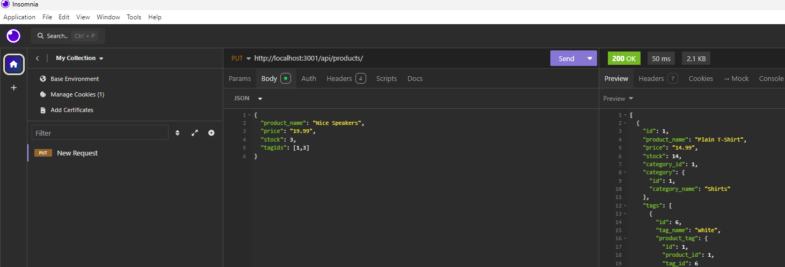

# E-Commerce Backend
[Link to demo](https://youtu.be/N2aI1IWNeDg) showing GET, POST, PUT, and DELETE.

## Table of Contents
- [E-Commerce Backend](#e-commerce-backend)
  - [Table of Contents](#table-of-contents)
  - [Description](#description)
  - [Installation](#installation)
  - [Usage](#usage)
  - [Contributing](#contributing)
  - [Questions](#questions)
## Description
This is an e-commerce application, created using Sequelize and PostgreSQL in the back end.  The user is able to retrieve products from the inventory, as well as update details such as price and stock.
## Installation
- `npm install`
- Create the postgres database with schema.sql
- `npm run seed` 
## Usage
`npm start` then use a program such as Insomnia or Postman to interact with the server.

## Contributing
Please follow the [Contributor Covenant](https://www.contributor-covenant.org/) guidelines.
## Questions
If you have any questions, please reach out to me at swokamoto@gmail.com. 
You can also check out the project at [https://github.com/swokamoto/e-commerce](https://github.com/swokamoto/e-commerce).
